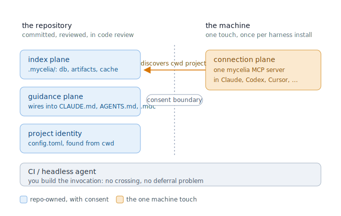

# V2 vision: three planes and one consent boundary

This is the canonical spine for the v2 concept pack. The other v2 documents
(`01`–`07`) and `docs/concept/24_dogfood_and_protocol_adoption.md` remain valid
for their detail and their lessons learned, but where any of them conflicts with
this file, this file wins. The reconciled statements are listed under
"What this supersedes" at the end.

## Thesis

Mycelia is project-attached context infrastructure for AI implementation agents,
built for mature teams and enterprise practice, not for a single developer who
owns the whole machine. The index is not the moat: every comparable tool already
indexes code. The unsolved problem the whole category shares is adoption, the
harness reads code with grep instead of the index. Mycelia's bet is to solve
adoption the way a team can review and own, not by quietly rewriting a
developer's machine.

## The spine: the project boundary is the consent boundary

There is exactly one rule that keeps the whole design coherent:

- Inside the repository, Mycelia may integrate aggressively, as long as every
  change is committed, idempotent, removable, and shown before it is written.
- Outside the repository, on the developer's machine, there is exactly one
  allowed touch: `connect`, which registers a single MCP server per harness.

"Non-invasive" never meant "do not touch instruction files." It means "nothing
hidden, and nothing at the machine level beyond the one server." Repo-owned and
reviewed is a yes, even when it is aggressive. Machine-level or hidden is a no.

## The three planes

### 1. Index plane (repo-owned)

The map lives in the repository under `.mycelia/`: `config.toml` for project
identity and policy, `db/` for the local SQLite index, plus `logs/`, `cache/`,
and optional `artifacts/`. The database is generated and git-ignored by default;
config and the guidance fragment are committed. See `03` for the layout and `05`
for artifact and CI-cache strategy.

### 2. Guidance plane (repo-owned)

`mycelia init` is responsible for making the repository tell its own agents to
use the index. It does this by detecting whatever instruction convention the
project already uses and wiring a Mycelia-owned, consent-gated, removable block
into it, rather than imposing a single new file and hoping a harness reads it.

Conventions to detect and integrate with include, at least:

- `AGENTS.md` and nested `AGENTS.md`,
- `CLAUDE.md`,
- Cursor rules (`.cursor/rules/*.mdc`),
- Codex project configuration,
- Antigravity and other harness-specific project rules,
- Claude Code project settings (`.claude/settings.json`).

`.mycelia/AGENTS.md` is the source fragment those wirings include or mirror, not
the only place guidance lives. Every write outside `.mycelia/` is previewed and
confirmed first (the default answer is no), and every owned block is idempotent
and easy to remove.

This plane is also where the measured adoption lever for Claude Code lives. When
the harness defers MCP tool schemas, the index loses to grep by default. The fix
is to set eager tool loading in the project's own `.claude/settings.json`, a
committed, reviewable, removable file inside the consent boundary. It is a
guidance-plane write, consent-gated like any other, never a user-level mutation.

### 3. Connection plane (one machine-level touch)

`mycelia connect` registers one generic Mycelia MCP server in a harness client
(Claude Code, Codex, Cursor, Claude Desktop). There is one server total, not one
per project. The server resolves which project and corpus to serve by walking up
from the launch working directory to `.mycelia/config.toml`. This is the only
action that writes outside the repository, and the user sees a single `mycelia`
entry in their harness settings.

## Lifecycle: why connection is not a contradiction

A surface reading of the north star ("the repository carries enough metadata for
any compatible agent to discover the index") suggests connection should also be
repo-carried, since a freshly cloned repo still needs the harness connected. It
is not a contradiction once the two actions are placed at their correct
lifecycle levels:

- `connect` is a per-harness-install action. A developer runs it once when they
  set up a harness on their machine, the same way they install the binary. It is
  not repeated per project.
- `init` is a per-clone action. A developer (or the team lead, once) runs it in
  the repository.

Because the single connected server self-discovers the project from cwd, one
`connect` per harness covers every repository the developer will ever clone and
`init`. Guidance and index are repo-carried; connection is a one-time machine
setup. That division is deliberate, not a seam to close.

## CI and headless agents: adoption by construction

The strongest wedge is the headless agent in CI, because it sidesteps the
adoption problem entirely. In an interactive local session, Mycelia competes for
the model's attention against an always-available grep reflex. In CI, the harness
invocation is built by us: `mycelia ci prepare` restores or refreshes the index
before the model spends tokens, and `mycelia ci seed-context` injects sourced
orientation (likely files, symbols, tests, queries) into the first prompt without
depending on the model choosing a tool. This is adoption by construction, not by
persuasion, and it is where the business claim (fewer tokens, better first
proposals from issue text) is cleanest to measure. See `04`. Treat the CI wedge
as the flagship, not a peer of the local journey.

## What this supersedes

- `01_product_thesis.md`, Non-goals: "No default mutation of root AGENTS.md,
  CLAUDE.md, Cursor rules" is replaced by "No silent or default-yes mutation."
  Consent-gated, convention-aware integration into those files is the guidance
  plane's primary job, not a prohibited act.
- `03_project_layout_and_consent.md`: `.mycelia/AGENTS.md` is the source fragment
  that `init` wires into the project's existing conventions, not the single
  canonical guidance file. The write-boundary and consent rules in `03` stand
  unchanged.
- `24_dogfood_and_protocol_adoption.md`: convention detection and consent-gated
  guidance integration are now a first-class plane, not the cautious opt-in
  afterthought that document frames them as. Its prohibition on silent mutation
  and its `stats`-as-adoption-surface direction still hold.

## What carries forward unchanged

All v1 correctness guarantees survive the rewrite: two-stage `find`/`retrieve`
under a token-per-answer gate, never serving a stale slice, query-time freshness
validation and self-heal, deterministic chunk identity, conservative typed graph
edges, eval-manifest exclusion, and read-only MCP with no model-facing mutation
tools. The full list lives in `07_requirements_carry_forward.md`.

The execution sequence from the current code to this vision, including the early
publish-or-shelf decision gate, lives in the repository-level `ROADMAP.md`.
